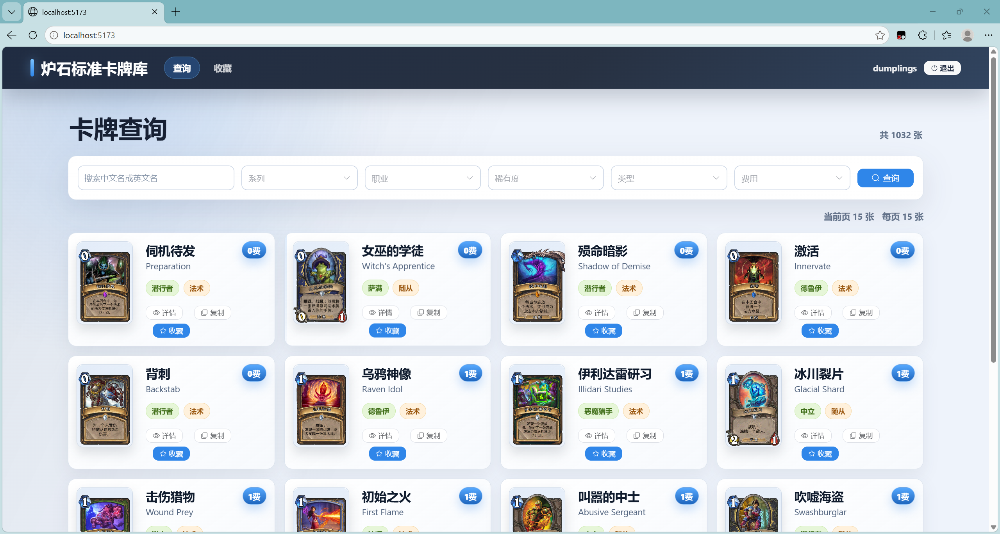

# Hearthstone Card Tool

炉石传说标准环境卡牌查询与收藏工具。项目采用前后端分离结构，后端位于 `backend`，前端位于 `frontend`，文档位于 `docs`。



## 功能

- 标准环境卡牌自动加载，默认按系列顺序、费用、中文名排序。
- 支持按名称、系列、职业、稀有度、类型和费用筛选，分页默认每页 15 张。
- 查询页和收藏页支持空状态、费用徽标、图标按钮和响应式卡牌布局。
- 卡牌详情弹窗展示图片、名称、系列、职业、类型、派系 / 种族、费用、稀有度、攻击、生命 / 耐久、描述、趣味文本和画家。
- 支持复制中文名、英文名，登录后可收藏、取消收藏并查看收藏列表。
- 支持注册、登录、退出；表单包含必填校验、提交状态和错误提示。
- 登录状态失效时会自动清理本地会话并跳转到登录页，访问受保护页面时会刷新当前用户信息。

## 技术栈

| 层级 | 技术 |
| --- | --- |
| 后端 | Java 17、Spring Boot 3、Spring Security、JWT、MyBatis-Plus、MySQL 8、Redis |
| 前端 | Vue 3、Vite、TypeScript、Pinia、Vue Router、Axios、Element Plus |

## 项目结构

```text
backend/   Spring Boot 后端
frontend/  Vue 3 前端
docs/      接口、数据库和开发说明
```

## 本地启动

环境要求：

- JDK 17
- Maven 3.9+
- Node.js 20+
- MySQL 8
- Redis 6+

准备配置：

1. 启动 MySQL 和 Redis。
2. 从 `backend/src/main/resources/application.example.yml` 复制生成 `backend/src/main/resources/application.yml`。
3. 按本机环境修改 `application.yml`，至少检查 MySQL、Redis 和 JWT 配置。
4. `application.yml` 是本地私有配置，不提交到 Git；公开模板保留在 `application.example.yml` 和 `.env.example`。

后端：

```bash
cd backend
mvn spring-boot:run
```

前端：

```bash
cd frontend
npm install
npm run dev
```

访问：

```text
http://localhost:5173
```

Vite 会把 `/api` 代理到 `http://localhost:8080`。后端默认允许 `http://localhost:5173` 和 `http://127.0.0.1:5173` 跨域访问，并放行 `OPTIONS` 预检请求。

## 配置

常用变量：

| 变量 | 说明 | 示例默认值 |
| --- | --- | --- |
| `MYSQL_URL` | MySQL JDBC 地址 | 本地 `hearthstone_cards` |
| `MYSQL_USERNAME` | MySQL 用户名 | `root` |
| `MYSQL_PASSWORD` | MySQL 密码 | `change_me` |
| `REDIS_HOST` | Redis 地址 | `localhost` |
| `REDIS_PORT` | Redis 端口 | `6379` |
| `REDIS_PASSWORD` | Redis 密码 | 空 |
| `JWT_SECRET` | JWT 签名密钥 | 占位值 |
| `CORS_ALLOWED_ORIGINS` | 允许跨域的前端地址 | `http://localhost:5173,http://127.0.0.1:5173` |

真实数据库密码、Redis 密码和 JWT 密钥只应存在于本地 `application.yml` 或环境变量中，不要提交到仓库。

## 数据初始化

项目随附标准环境卡牌 seed 数据。首次建库或需要重建内置卡牌数据时，使用 `init` profile 启动一次后端：

```bash
cd backend
mvn spring-boot:run -Dspring-boot.run.profiles=init
```

`application-init.yml` 会执行：

- `classpath:db/schema.sql`
- `classpath:db/cards_seed.sql`

执行完成后，数据库会包含当前标准环境的 1032 张卡牌。普通启动使用 `application.yml`，`spring.sql.init.mode` 默认为 `never`，不会反复重建表或覆盖数据。

内置数据文件：

- `backend/src/main/resources/data/cards_seed.json`
- `backend/src/main/resources/db/cards_seed.sql`

应用运行时不访问外部数据源，也不下载卡牌图片文件；数据库只保存图片 URL。

## 标准系列

当前按以下顺序展示和排序：

1. 核心2026
2. 治愈艾泽拉斯
3. 大地的裂变
4. 永恒回响
5. 穿越时间流
6. 重生之日
7. 安戈洛龟途
8. 世界之树的余烬
9. 漫游翡翠梦境

## 验证

后端测试：

```bash
cd backend
mvn test
```

前端构建：

```bash
cd frontend
npm run build
```

## 文档

- [接口文档](docs/API.md)
- [数据库说明](docs/DATABASE.md)
- [开发指南](docs/DEV_GUIDE.md)

## 后续计划

- 卡牌列表展示收藏状态。
- 收藏按钮根据状态显示“收藏 / 已收藏”。
- 增加 Docker Compose 一键启动。
- 增加自动化接口测试。
- 增加搜索关键词高亮。
- 增加按费用、稀有度、职业统计卡牌数量。

## 许可证与说明

本仓库代码采用 [MIT License](LICENSE)。

本项目仅用于个人学习与技术交流，不用于商业用途。炉石传说、Hearthstone、相关卡牌名称、文本、图片、商标和其他游戏内容归其权利方所有，不包含在本仓库代码许可证授权范围内。
